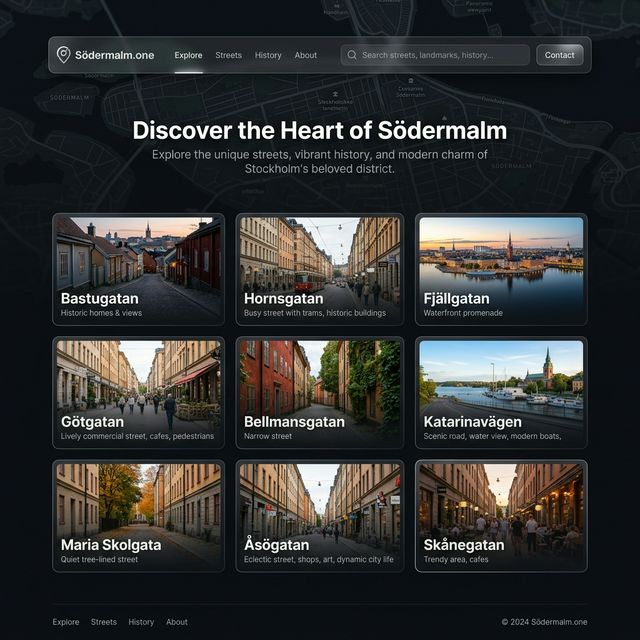

# Södermalm.one - Upptäck gatorna

En modern, interaktiv guide till Södermalms gator och historia. Den här webbplatsen är en moderniserad version av det omfattande historiska material samlat av Bengt-Göran Jönsson.



## 🏙 Om projektet
Projektet syftar till att göra det rika historiska materialet om Södermalms gator mer tillgängligt genom ett modernt, responsivt gränssnitt. 

### Funktioner
- **Interaktivt gaturutnät**: Utforska 76 olika gator och områden på Södermalm.
- **Blixtsnabb sökning**: Hitta rätt gata direkt via sökfältet.
- **Modern estetik**: Mörkt tema med "glassmorphism", mjuka animationer och premium-typografi.
- **Originalinnehåll**: Det historiska materialet visas i ett snyggt modalfönster för en sömlös upplevelse.

## 🛠 Teknik stack
- **HTML5/CSS3**: Modern layout med CSS Grid och glassmorphism.
- **Vanilla JavaScript**: Snabb och lättviktig interaktivitet utan externa ramverk (förutom Phosphor Icons).
- **Python**: Automatiserad datainsamling och indexering.

## 🚀 Komma igång
Eftersom detta är en helt statisk webbplats kan du köra den på två sätt:

1. **Direkt i webbläsaren**: Dubbelklicka på `index.html` i din filhanterare. Webbsidan är optimerad för att fungera direkt från filsystemet.
2. **Via en webbserver**: Kör en enkel server i projektmappen, till exempel:
   ```bash
   python3 -m http.server
   ```
   Öppna sedan `http://localhost:8000` i din webbläsare.

## 🔄 Uppdatera data
Om du lägger till nya gatumappar under `sodermalm.one/` kan du automatiskt uppdatera webbplatsens index genom att köra:

```bash
python3 update_data.py
```

Detta skript skannar alla mappar, letar efter representativa bilder och HTML-sidor, och uppdaterar `data.js` automatiskt.

## 📂 Filstruktur
- `index.html`: Landningssidan.
- `style.css`: All styling och design.
- `app.js`: Logik för sökning och rendering.
- `data.js`: Innehåller all indexerad gatuinformation (genereras av Python-skriptet).
- `update_data.py`: Hjälpskript för att uppdatera indexet.
- `sodermalm.one/`: Mappen som innehåller allt originalinnehåll (bilder och HTML).

---
*Sammanställt och moderniserat för att bevara Södermalms historia.*
